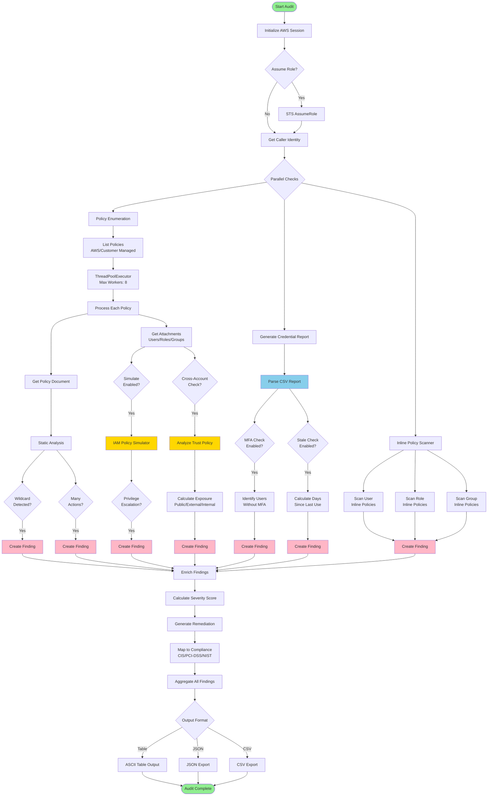

# AWS IAM Policy Audit

## Description

AWS IAM Policy Audit is a comprehensive security assessment tool designed to analyze and audit AWS IAM policies for potential security vulnerabilities and compliance violations. This tool helps security teams identify risky permissions, detect privilege escalation paths, enforce MFA policies, and maintain least-privilege access across AWS accounts.

The tool performs deep analysis of IAM policies, simulates principal permissions, tracks credential usage, and generates actionable remediation guidance mapped to industry compliance frameworks including CIS AWS Foundations, PCI-DSS, and NIST 800-53.

## Features

- **Wildcard Permission Detection** - Identifies overly permissive policies with `Action: "*"` or unrestricted resource access
- **Excessive Action Analysis** - Flags policies exceeding configurable action thresholds
- **Privilege Escalation Detection** - Discovers 30+ known privilege escalation patterns and attack paths
- **Cross-Account Trust Evaluation** - Analyzes role trust policies for external account and public exposure risks
- **MFA Enforcement Auditing** - Identifies users without multi-factor authentication enabled
- **Stale Credential Detection** - Finds dormant users with unused access keys or passwords (configurable inactivity period)
- **Inline Policy Scanning** - Flags inline policies as anti-patterns and recommends managed policies
- **Sensitive Action Simulation** - Uses AWS `SimulatePrincipalPolicy` API to test real-world permissions against high-risk actions
- **Compliance Mapping** - Maps findings to CIS AWS Foundations Benchmark, PCI-DSS, NIST 800-53, and AWS Well-Architected Framework
- **Automated Remediation Guidance** - Provides actionable CLI commands and best practices for each finding
- **Severity Scoring** - Risk-based scoring (0-100) considering impact, likelihood, and exposure
- **Multi-Format Reporting** - Export results as formatted tables, JSON, or CSV for integration with other tools

## Tech Stack

- **Language**: Python 3.7+
- **AWS SDK**: boto3 (AWS SDK for Python)
- **APIs Used**:
  - AWS IAM (Identity and Access Management)
  - AWS STS (Security Token Service)
  - IAM Credential Reports
  - IAM Policy Simulator
- **Concurrency**: ThreadPoolExecutor for parallel policy processing
- **Output Formats**: JSON, CSV, ASCII Table

## Architecture



The architecture follows a parallel processing model where policy analysis, credential reporting, and inline policy scanning occur concurrently. Each policy is processed through a thread pool for efficient execution, with findings enriched with severity scores, remediation steps, and compliance mappings before final output generation.

## Installation & Setup

### Prerequisites

```bash
# Python 3.7 or higher
python --version

# AWS CLI configured with credentials
aws configure
```

### Installation

1. Clone the repository:
```bash
git clone https://github.com/suvadityaroy/AWS-IAM-Policy-Audit.git
cd AWS-IAM-Policy-Audit
```

2. Install dependencies:
```bash
pip install boto3
```

3. Configure AWS credentials (if not already configured):
```bash
aws configure
```

### Required IAM Permissions

The audit tool requires the following IAM permissions. Create a dedicated auditor role with this policy:

```json
{
  "Version": "2012-10-17",
  "Statement": [
    {
      "Effect": "Allow",
      "Action": [
        "iam:ListPolicies",
        "iam:GetPolicy",
        "iam:GetPolicyVersion",
        "iam:ListEntitiesForPolicy",
        "iam:GetRole",
        "iam:GetUser",
        "iam:GetGroup",
        "iam:ListUsers",
        "iam:ListRoles",
        "iam:ListGroups",
        "iam:ListUserPolicies",
        "iam:ListRolePolicies",
        "iam:ListGroupPolicies",
        "iam:SimulatePrincipalPolicy",
        "iam:GenerateCredentialReport",
        "iam:GetCredentialReport"
      ],
      "Resource": "*"
    }
  ]
}
```

### Usage

**Basic scan:**
```bash
python aws-iam_policyaudit.py
```

**Comprehensive security audit:**
```bash
python aws-iam_policyaudit.py \
  --simulate \
  --check-privesc \
  --check-cross-account \
  --check-mfa \
  --check-stale \
  --check-inline \
  --format json \
  --output security-audit.json
```

**Quick MFA and credential check:**
```bash
python aws-iam_policyaudit.py --check-mfa --check-stale
```

**Available options:**
- `--threshold N` - Action count threshold (default: 20)
- `--include-aws-managed` - Include AWS-managed policies
- `--simulate` - Simulate sensitive actions per principal
- `--check-privesc` - Detect privilege escalation patterns
- `--check-cross-account` - Analyze cross-account trust policies
- `--check-mfa` - Check for users without MFA
- `--check-stale` - Detect unused credentials
- `--check-inline` - Flag inline policies
- `--stale-days N` - Days threshold for stale credentials (default: 90)
- `--format table|json|csv` - Output format
- `--output FILE` - Write results to file
- `--profile PROFILE` - AWS CLI profile to use
- `--region REGION` - AWS region
- `--assume-role-arn ARN` - Role ARN to assume

## Author

**Suvaditya Roy**

GitHub: [suvadityaroy](https://github.com/suvadityaroy)
